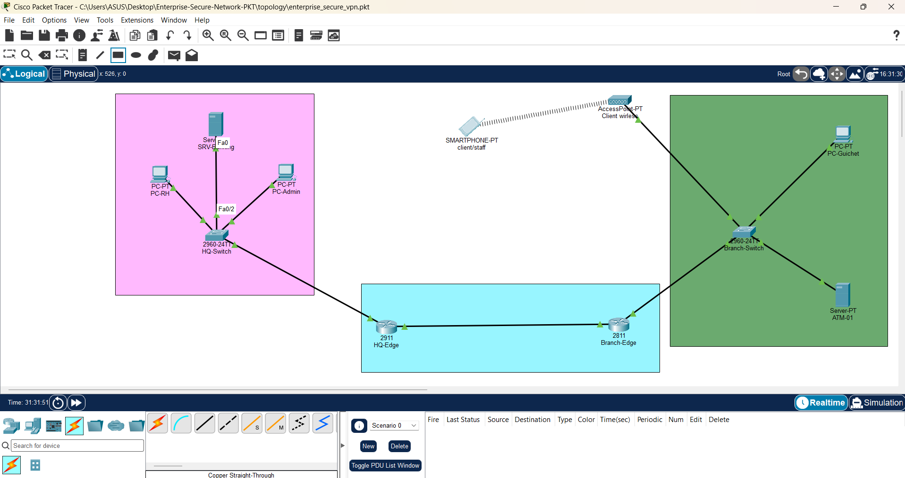

# Secure Multi-VLAN Enterprise Network with Site-to-Site IPsec VPN & Guest Wi-Fi


---

## 📌 Project Overview

This project implements an enterprise-grade banking network simulation connecting a **Headquarters (HQ)** and a **Remote Branch** over an untrusted WAN transit network. 

The architecture enforces end-to-end data confidentiality, strict Layer 2/3 traffic segmentation, and a **Zero-Trust** guest wireless deployment allowing customers to securely interact with the core banking application without compromising internal banking systems.

---

## 🗺️ Network Topology



---

## ⚙️ Key Architectural Highlights

* **Site-to-Site IPsec VPN (IKEv1):** Secure WAN interconnect between HQ and Branch using AES-256 encryption, SHA hashing, and Diffie-Hellman Group 2.
* **Inter-VLAN Routing (802.1Q):** Router-on-a-Stick deployment separating management, core application servers, staff workstations, and ATMs.
* **Guest Wi-Fi Isolation (VLAN 60):** Isolated customer wireless subnet with automated DHCP addressing and targeted ingress ACL enforcement.
* **NAT-Exemption (No-NAT):** Coexistence of Port Address Translation (PAT) for Internet egress and transparent IPsec encapsulation for internal corporate traffic.

---

## 📊 IP Addressing & VLAN Scheme

| Site | Device | Segment Name | VLAN ID | Subnet / Mask | Default Gateway |
| :--- | :--- | :--- | :--- | :--- | :--- |
| **WAN** | Transit Link | Point-to-Point WAN | — | `203.0.113.0/30` | HQ: `.1` / Branch: `.2` |
| **HQ** | HQ-Edge (2911) | Core Banking Servers | 20 | `10.10.20.0/24` | `10.10.20.1` |
| **Branch** | Branch-Edge (2811) | Staff & Tellers | 40 | `10.20.40.0/24` | `10.20.40.1` |
| **Branch** | Branch-Edge (2811) | ATM / Kiosk Machines | 50 | `10.20.50.0/24` | `10.20.50.1` |
| **Branch** | Branch-Edge (2811) | Customer Guest Wi-Fi | 60 | `10.20.60.0/24` | `10.20.60.1` |

---

## 🛡️ Security Policy & Ingress ACL Matrix

To comply with banking security standards, the **VLAN 60 (Guest Wi-Fi)** segment is restricted at the ingress interface (`Fa0/0.60 in`) via extended access lists:

| Source | Destination | Protocol / Port | Action | Security Objective |
| :--- | :--- | :--- | :--- | :--- |
| `10.20.60.0/24` | `10.10.20.100` (Core Server) | TCP 80, 443 | **PERMIT** | Allow banking app access (transfers & balance checks). |
| `10.20.60.0/24` | Any | UDP/TCP 53 | **PERMIT** | DNS query resolution. |
| `10.20.60.0/24` | `10.20.0.0/16` (Local LAN) | Any | **DENY** | Prevent lateral movement to Branch Staff and ATM VLANs. |
| `10.20.60.0/24` | `10.10.0.0/16` (HQ LAN) | Any | **DENY** | Prevent unauthorized access to internal HQ resources. |
| `10.20.60.0/24` | Any (Internet) | Any | **PERMIT** | Standard outbound Internet navigation via NAT. |

---

## 🔍 Verification & Operational Proofs

### 1. IPsec Phase 1 (ISAKMP) & Phase 2 (ESP Encapsulation)
The tunnel establishes in `QM_IDLE` state with symmetric transform sets (`esp-aes 256 esp-sha-hmac`).

```text
Branch-Edge# show crypto isakmp sa
IPv4 Crypto ISAKMP SA
dst             src             state          conn-id slot status
203.0.113.1     203.0.113.2     QM_IDLE              1    0 ACTIVE